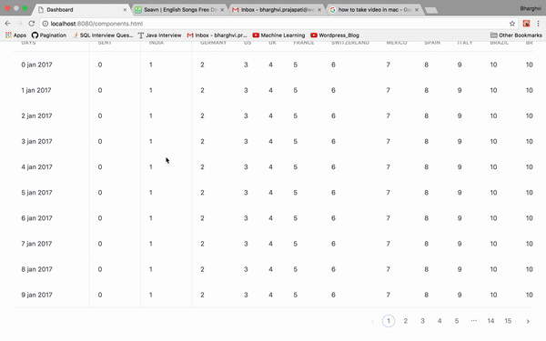

# React Pagination with Table

This component creates a pagination for the table along with change of table connect as per the selected.
It uses npm's `react-pagination` module.

## Usage

```javascript
import TablePager from 'react-pagination-usage'
<TablePager
        headers={tableHeaders}
        data={tableData}
        pageSize={PAGE_SIZE}
/>
```
## Props

Prop Names | Type | Usage
------------ | ------------ | -------------
headers | array | headers of table
data | array | data to be displayed in table as per the headers (whole content, not page-wise)
pageSize | int | number of items to be displayed in a page

As per the `data` and `pageSize` passed, it creates Total Count of pages. The data in each page is handled dynamically.

## Example



